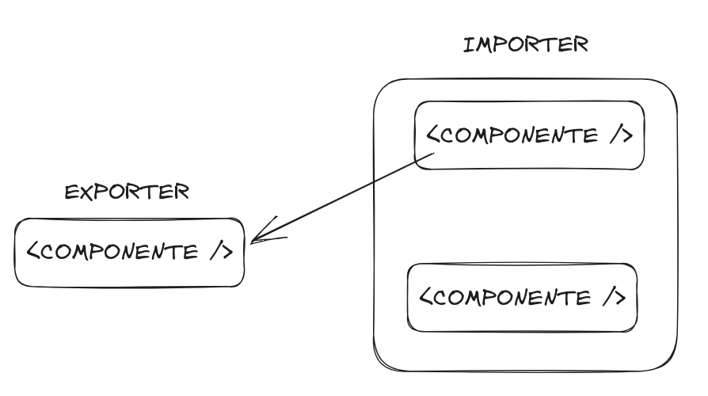

    

<h1></h1>

  <a href="#-projeto">Projeto</a>&nbsp;&nbsp;&nbsp;|&nbsp;&nbsp;&nbsp;
  <a href="#-tecnologias">Tecnologias</a>&nbsp;&nbsp;&nbsp;|&nbsp;&nbsp;&nbsp;
  <a href="#-desenvolvimento">Desenvolvimento</a>&nbsp;&nbsp;&nbsp;|&nbsp;&nbsp;&nbsp;
  <a href="#-instalação">Instalação</a>

## 💻 Projeto

Exemplo de envio de e-mail

## 🚀 Tecnologias

Esse projeto foi desenvolvido com as seguintes tecnologias:

- [NextJs](https://nextjs.org/)
- [React](https://react.dev/)
- [Module federation](https://www.npmjs.com/package/@module-federation/nextjs-mf)

## 🧑‍🔧 Desenvolvimento

- [TypeScript](https://www.typescriptlang.org/)
- [Concurrently](https://www.npmjs.com/package/concurrently)

## 🧩 Instalação

### Baixe o projeto
    $ git clone https://github.com/rodrigobarbosa12/micro-frontend-nextjs.git

### Instale todas as dependências
    $ npm install

### Execute localmente
    $ npm run start

## Autor

<a href="https://www.linkedin.com/in/rodrigo-barbosa-7a1429157/">
 
    <b>Rodrigo Barbosa</b>
 
</a>
<a href="#" title="Rocket">🚀</a>

  
  

<Feito com 💙 />
